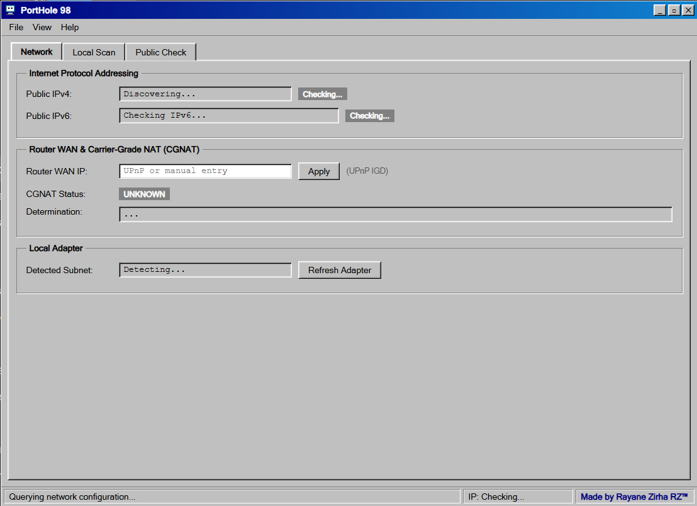

# PortHole 98

> **PortHole 98** is a classic Windows 95/98 styled network diagnostic dashboard built with **Python 3.11+**, **FastAPI**, and a zero-dependency retro HTML5/CSS3/JavaScript frontend. It identifies open ports on your local network, checks whether your public IP is reachable from the internet, and measures TCP connect latency from nodes across 5 continents.



---

## Features

- **Public IP & CGNAT Detection**:
  - Automatically discovers public IPv4 and IPv6 via `api.ipify.org` and `api64.ipify.org`.
  - Queries router WAN IP via UPnP IGD (`miniupnpc`), with manual WAN IP entry fallback.
  - Accurately classifies Carrier-Grade NAT (CGNAT) by analyzing IP parity, RFC 6598 (`100.64.0.0/10`), and RFC 1918 private address ranges.
- **Two-Stage Local Subnet Scanner**:
  - **Stage 1 (Host Discovery)**: Probes `/24` subnets (capped at /24 for safety) to rapidly detect responsive live hosts.
  - **Stage 2 (Port Scanning)**: Scans open ports only on live hosts using an asynchronous TCP connect scanner with `asyncio.Semaphore(200)` and a `0.5s` connection timeout.
  - Reverse DNS hostname lookups and automatic service name guessing via `socket.getservbyport` with fallback dictionary (including Minecraft `25565`, `8080`, `8443`, etc.).
- **Global Multi-Continent Reachability & Latency (check-host.net)**:
  - Measures TCP connect latency to your public port from 5 geographic regions: **Europe**, **North America**, **Asia**, **South America**, and **Oceania**.
  - Defensive parsing for all payload formats (success, timeouts, connection refused, pending nulls, and unknown shapes).
  - Multi-run iterations (1–5 runs, default 3) with median, min, max, and failed run statistics.
  - In-memory 45-second cache to prevent excessive queries and respect external rate limits.
- **Authentic Windows 95/98 Retro UI**:
  - Classic teal desktop (`#008080`), 3D beveled windows and buttons, navy-to-blue title bar gradient, sunken inputs and list views, MS Sans Serif & Courier New typography.
  - Draggable window with boundary constraint, taskbar with working live clock, Start menu, tabbed navigation, column-header sorting, segmented blue-block progress bars, and classic modal dialogs.
  - **Zero external dependencies**: No UI frameworks, no CDNs, no external image files (pure CSS/SVG pixel artwork).
- **Dual Runtime Modes**:
  - Standard web server mode (`uvicorn app.main:app --reload`).
  - Native standalone desktop application mode (`python desktop.py` with `pywebview`).

---

## Project Structure

```text
PortHole/
├── app/
│   ├── __init__.py
│   ├── config.py                # Configuration and resource path helpers
│   ├── main.py                  # FastAPI application & route registration
│   ├── models.py                # Pydantic v2 data models
│   ├── services/
│   │   ├── __init__.py
│   │   ├── checkhost.py         # check-host.net integration, parsing, caching
│   │   ├── local_scan.py        # Two-stage async TCP connect subnet scanner
│   │   ├── network_info.py      # ipify discovery, UPnP, and CGNAT logic
│   │   └── safety.py            # Rate limiting, subnet caps, target validators
│   └── utils/
│       ├── __init__.py
│       └── stats.py             # Defensive median, min, max, failed statistics
├── build/
│   ├── build_exe.bat            # PyInstaller Windows build script
│   └── icon.ico                 # Retro application icon
├── web/
│   ├── index.html               # Classic Windows 95/98 HTML structure
│   ├── style.css                # 3D bevels, classic palette, retro styling
│   └── app.js                   # Client interactivity, drag-drop, API polling
├── tests/
│   ├── test_api.py              # Endpoint integration tests
│   ├── test_cgnat.py            # CGNAT classification unit tests
│   ├── test_checkhost.py        # Defensive parsing and latency statistics tests
│   └── test_safety.py           # Subnet boundaries and rate limiter tests
├── desktop.py                   # PyWebview native desktop launcher
├── requirements.txt             # Python dependencies
├── .env.example                 # Environment defaults
├── pytest.ini                   # Pytest test configuration
├── PLAN.md                      # Milestone implementation plan
└── README.md                    # Project documentation
```

---

## Installation & Requirements

### Prerequisites
- **Python 3.11+** (Python 3.11, 3.12, 3.13, 3.14 supported).
- Windows 10/11 or modern Linux/macOS.

### Setup
1. Clone or navigate to the project directory:
   ```bash
   cd PortHole
   ```
2. (Recommended) Create and activate a virtual environment:
   ```bash
   python -m venv .venv
   # Windows:
   .venv\Scripts\activate
   # Linux/macOS:
   source .venv/bin/activate
   ```
3. Install dependencies:
   ```bash
   pip install -r requirements.txt
   ```
4. Copy the environment configuration template:
   ```bash
   cp .env.example .env
   ```

---

## How to Run

### Mode 1: Development Server (Web Browser)
Run the FastAPI development server with auto-reload:
```bash
uvicorn app.main:app --reload
```
Open your browser and navigate to:
```text
http://127.0.0.1:8000/
```

### Mode 2: Native Desktop Application
Run the standalone desktop window using `pywebview`:
```bash
python desktop.py
```
*Note: On Windows, `pywebview` utilizes Microsoft Edge WebView2 (pre-installed on Windows 10/11). If WebView2 is absent, an informational dialog directs you to the official Microsoft installer.*

---

## API Endpoints

### 1. Network Discovery
`GET /api/network`
- **Query Parameters**:
  - `wan_ip` (optional, string): Manually entered router WAN IP to evaluate CGNAT when UPnP IGD is unavailable.
- **Response**:
  ```json
  {
    "public_ipv4": "102.97.50.160",
    "public_ipv6": null,
    "router_wan_ip": "102.97.50.160",
    "local_subnet": "192.168.1.0/24",
    "cgnat": false,
    "reason": "Router WAN IP matches public IPv4 (102.97.50.160). No CGNAT detected."
  }
  ```

### 2. Check-Host Active Nodes
`GET /api/nodes`
- **Response**: List of 5 regional nodes in use across Europe, North America, Asia, South America, and Oceania.
  ```json
  [
    { "id": "de1.node.check-host.net", "name": "Germany (Frankfurt)", "country": "Germany", "region": "Europe" },
    { "id": "ca1.node.check-host.net", "name": "Canada (Vancouver)", "country": "Canada", "region": "North America" },
    { "id": "hk1.node.check-host.net", "name": "Hong Kong (Hong Kong)", "country": "Hong Kong", "region": "Asia" },
    { "id": "br1.node.check-host.net", "name": "Brazil (Sao Paulo)", "country": "Brazil", "region": "South America" },
    { "id": "au1.node.check-host.net", "name": "Australia (Sydney)", "country": "Australia", "region": "Oceania" }
  ]
  ```

### 3. Local Subnet Scan
`POST /api/scan/local`
- **Request Body**:
  ```json
  {
    "subnet": "192.168.1.0/24",
    "ports": "common"
  }
  ```
  *(Supported port profiles: `"common"` [21 common ports including 25565] or `"top1024"` [ports 1–1024]).*
- **Safety Restriction**: Strictly limited to private RFC 1918 subnets (`10.0.0.0/8`, `172.16.0.0/12`, `192.168.0.0/16`) and capped at `/24`. Public subnets and subnets larger than `/24` return HTTP 400.
- **Rate Limit**: 5 triggers per minute per client IP.
- **Response**: `{ "job_id": "47c7c52f982e47b8b9925d2664b8ac15" }`

`GET /api/scan/local/{job_id}`
- **Poll Status**: Returns progress percentage (0–100) and discovered devices. (Exempt from rate limits).
- **Response**:
  ```json
  {
    "job_id": "47c7c52f982e47b8b9925d2664b8ac15",
    "status": "completed",
    "progress": 100,
    "devices": [
      {
        "ip": "192.168.1.1",
        "hostname": "router.local",
        "open_ports": [
          { "port": 53, "service": "domain" },
          { "port": 80, "service": "http" },
          { "port": 443, "service": "https" }
        ]
      }
    ]
  }
  ```

### 4. Global Public Port Reachability Check
`POST /api/check/public`
- **Request Body**:
  ```json
  {
    "port": 80,
    "runs": 3
  }
  ```
  *(Target host is strictly locked to this machine's verified public IPv4. Runs between 1 and 5).*
- **Rate Limit**: 5 triggers per minute per client IP.
- **Response**: `{ "job_id": "c4b8e01344494ea9becaef4b8f23bb2b" }`

`GET /api/check/public/{job_id}`
- **Poll Status**: Returns aggregated latency statistics across all 5 continents. (Exempt from rate limits).
- **Response**:
  ```json
  {
    "job_id": "c4b8e01344494ea9becaef4b8f23bb2b",
    "status": "completed",
    "results": [
      {
        "location": "Germany (Frankfurt)",
        "country": "Germany",
        "region": "Europe",
        "status": "Open",
        "median": 45.2,
        "min": 44.1,
        "max": 47.8,
        "failed": 0
      }
    ]
  }
  ```

---

## check-host.net Rate Limits & Caching

The public check service queries `https://check-host.net`. Please be aware of the following policies enforced in the backend:
1. **In-Memory Caching (45 Seconds)**: Successful check results for a given `(port, runs)` configuration are cached for 45 seconds. Repeated checks within this window return cached data instantly without hitting the external API.
2. **Defensive Delays**: Multi-run tests execute with a 1.2-second pause between iterations to prevent tripping check-host's IP rate limit.
3. **Trigger Rate Limit**: Client-side triggers are capped at 5 trigger requests per minute per IP.
4. **Data Privacy**: No scan or check results are written to disk or persisted to databases.

---

## Running the Automated Test Suite

Run the full pytest suite:
```bash
python -m pytest
```
Output:
```text
tests\test_api.py ......                                                 [ 21%]
tests\test_cgnat.py .......                                              [ 46%]
tests\test_checkhost.py .........                                        [ 78%]
tests\test_safety.py ......                                              [100%]
============================= 28 passed in 7.33s ==============================
```

---

## Building the Standalone Windows Executable (.exe)

To bundle PortHole 98 into a standalone Windows executable:
1. Ensure `pyinstaller` is installed:
   ```bash
   pip install pyinstaller
   ```
2. Run the build batch file:
   ```bash
   build\build_exe.bat
   ```
3. The compiled binary will be placed at:
   ```text
   dist\PortHole98.exe
   ```

---

## Disclaimer & Legal Notice

> **IMPORTANT**: Only scan networks you own or have explicit permission to test. Unauthorized port scanning may violate local laws and network terms of service.
